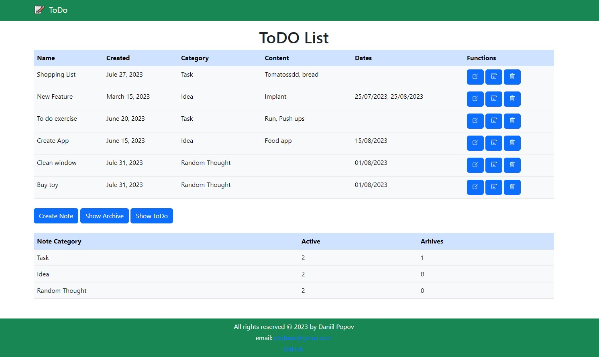

## App view

## Description of the project

The "To-Do List" web app is a convenient tool for organizing tasks, ideas, and various random thoughts. This app helps users efficiently plan and manage their time, easing the organization of day-to-day tasks and projects.

## Implemented

1. One-page web app.
2. Create, edit, and remove tasks, ideas, or random thoughts in the to-do list.
3. Move or remove task, idea or random thought from/to archive.

## Technology stack:

## Link to web app:
[Link to web app](https://daniilpopov0809.github.io/radency-ht-01/)

## Test task:
[Test task](https://drive.google.com/file/d/1Q5mCHsMI14bH4oT4ngE39CYfnOoct-N1/view?usp=sharing)